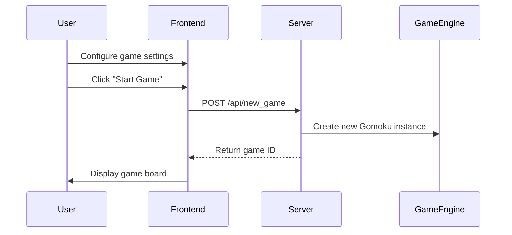
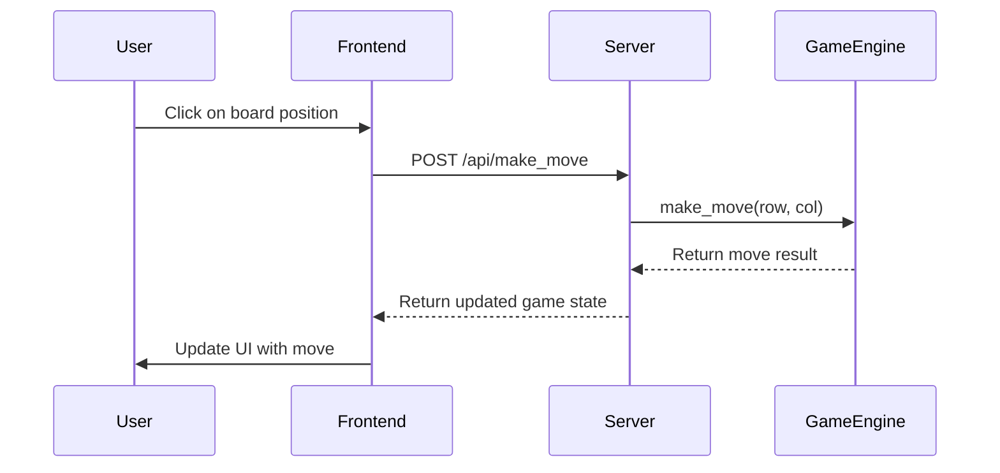
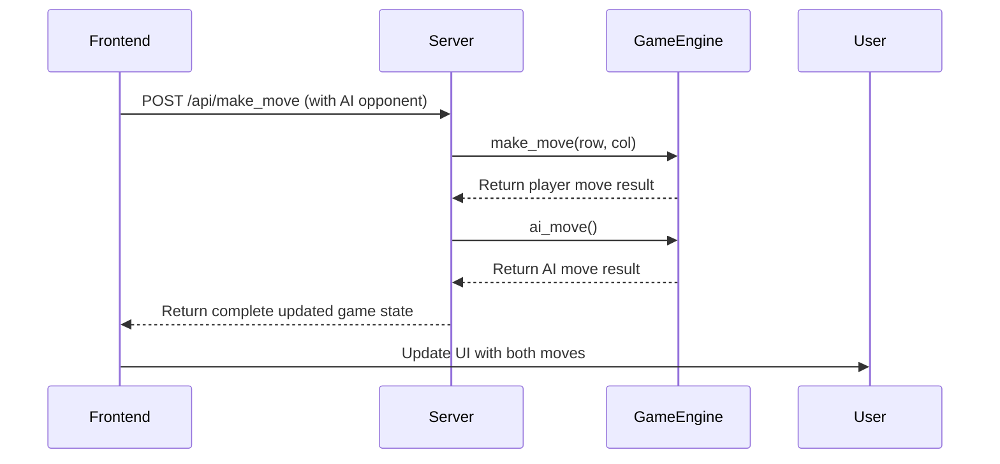

# Gomoku Game Architecture

## Overview

This document provides a comprehensive overview of the Gomoku Master game architecture, detailing its components, workflows, and implementation details.

## System Architecture

The Gomoku Master game follows a client-server architecture with clear separation of concerns:

```
┌─────────────────┐     ┌─────────────────┐     ┌─────────────────┐
│                 │     │                 │     │                 │
│  Web Frontend   │◄───►│  Flask Server   │◄───►│  Game Engine    │
│  (index.html)   │     │  (app.py)       │     │  (gomoku.py)    │
│                 │     │                 │     │                 │
└─────────────────┘     └─────────────────┘     └─────────────────┘
```

### Key Components

1. **Game Engine (`gomoku.py`)**: Core game logic and AI implementation
2. **Web Server (`app.py`)**: Flask-based RESTful API server
3. **Web Frontend (`index.html`)**: HTML/CSS/JavaScript UI
4. **Setup Script (`run_game.sh`)**: Cross-platform launcher

## Component Details

### 1. Game Engine (gomoku.py)

The core game logic is implemented in `gomoku.py` as a standalone Python module.

#### Key Classes

- **Player (Enum)**: Represents player types (NONE, BLACK, WHITE)
- **Gomoku**: Main game class that encapsulates all game functionality

#### Key Methods

- **`__init__(board_size=15, difficulty=3)`**: Initializes the game with configurable board size and difficulty
- **`make_move(row, col)`**: Processes a player's move with validation
- **`ai_move()`**: Calculates and executes the AI's move
- **`_find_best_move()`**: AI decision-making logic
- **`_negamax(depth, player)`**: Negamax algorithm implementation
- **`_check_win(row, col)`**: Checks if the last move resulted in a win
- **`reset()`**: Resets the game state

#### AI Implementation

The AI uses the Negamax algorithm (a variant of Minimax) with different search depths based on difficulty level:

- **Level 1**: Random valid moves
- **Level 2**: Basic strategy (win detection, blocking)
- **Level 3**: Intermediate strategy with threat detection
- **Level 4-5**: Advanced strategy with deeper Negamax search

### 2. Web Server (app.py)

The Flask-based web server provides a RESTful API for the frontend.

#### API Endpoints

- **`GET /`**: Serves the main game interface (index.html)
- **`GET /static/<path>`**: Serves static assets (images, sounds, JS)
- **`POST /api/new_game`**: Creates a new game instance with specified board size and difficulty
- **`POST /api/make_move`**: Processes a player's move and returns updated game state
- **`POST /api/reset`**: Resets an existing game with optional new settings

#### API Request/Response Formats

**POST /api/new_game**
```json
// Request
{
  "boardSize": 15,  // Optional, defaults to 15
  "difficulty": 3   // Optional, defaults to 3
}

// Response
{
  "gameId": "1",
  "boardSize": 15,
  "message": "Game created successfully"
}
```

**POST /api/make_move**
```json
// Request
{
  "gameId": "1",
  "row": 7,
  "col": 7,
  "opponent": "ai"  // "ai" or "human"
}

// Response
{
  "valid": true,
  "board": [[0,0,0,...], [0,1,0,...], ...],  // 2D array of board state
  "gameOver": false,
  "winner": null,    // null, 1 (BLACK), or 2 (WHITE)
  "message": "Move successful",
  "aiMove": {        // Only present if opponent is "ai" and game not over
    "row": 8,
    "col": 8
  }
}
```

**POST /api/reset**
```json
// Request
{
  "gameId": "1",
  "boardSize": 15,  // Optional
  "difficulty": 3   // Optional
}

// Response
{
  "message": "Game reset successfully",
  "boardSize": 15
}
```

#### Error Handling

The API implements proper error handling with appropriate HTTP status codes:

- **404 Not Found**: When a game ID doesn't exist
- **400 Bad Request**: When a move is invalid (e.g., outside the board or on an occupied cell)
- **500 Internal Server Error**: For unexpected server errors

Example error response:
```json
{
  "valid": false,
  "message": "Invalid move: cell already occupied"
}
```

#### Server-Side Game Management

- Games are stored in a dictionary with unique game IDs
- Each game is an instance of the `Gomoku` class
- The server handles game creation, move validation, and AI responses
- The server converts between the `Player` enum used in the backend and integer values used in the frontend

### 3. Web Frontend (index.html)

The frontend is implemented as a single HTML file with embedded CSS and JavaScript.

#### UI Components

- Game board with interactive grid
- Game settings panel (board size, difficulty, opponent type)
- Player indicators and status display
- Modal dialogs for player names and help
- Advanced settings panel
- Responsive design for different screen sizes

#### JavaScript Implementation

- **Game State Management**: Maintains a client-side game state object that tracks:
  ```javascript
  let gameState = {
      board: [],            // 2D array representing the board
      boardSize: 15,        // Size of the board (9, 15, or 19)
      difficulty: 3,        // AI difficulty level (1-5)
      opponent: 'ai',       // Type of opponent ('ai' or 'human')
      algorithm: 'negamax', // AI algorithm used
      gameActive: false,    // Whether a game is in progress
      currentPlayer: 1,     // Current player (1 for Black, 2 for White)
      gameId: null,         // ID of the current game on the server
      winner: null,         // Winner of the game (null, 1, or 2)
      player1Name: 'Player 1',
      player2Name: 'Gomoku Master AI'
  };
  ```

- **API Communication**: The frontend communicates with the backend through these key functions:
  - `startGame()`: Initializes a new game by calling `/api/new_game`
  - `makeMove(row, col)`: Sends a move to the server via `/api/make_move`
  - `resetGame()`: Resets the game via `/api/reset`

- **Board Rendering**: Uses HTML/CSS for the board and stones, with Canvas for grid lines
  - `drawBoard()`: Renders the board grid using Canvas
  - `drawStone(row, col, player)`: Creates and animates stone elements
  - Dynamic sizing based on viewport dimensions

- **Event Handling**:
  - Click events on the board to place stones
  - UI controls for game settings
  - Modal interactions for player names and help
  - Responsive adaptations for different devices

- **Sound System**: Implements sound effects for:
  - Stone placement
  - Win/loss conditions
  - Error notifications (invalid moves)

#### Frontend-Backend Integration

The frontend and backend are integrated through the RESTful API:

1. **Game Initialization Flow**:
   - User configures settings in the UI
   - Frontend calls `/api/new_game` with settings
   - Backend creates a `Gomoku` instance and returns a game ID
   - Frontend stores the game ID for subsequent API calls

2. **Move Processing Flow**:
   - User clicks on the board to place a stone
   - Frontend validates the move locally
   - Frontend sends move to backend via `/api/make_move`
   - Backend processes the move and returns updated game state
   - Frontend updates the UI based on the response
   - If playing against AI, the backend automatically makes the AI move and includes it in the response

3. **Game Reset Flow**:
   - User clicks "Reset Game"
   - Frontend calls `/api/reset` with the current game ID
   - Backend creates a new `Gomoku` instance
   - Frontend reinitializes the board and UI

### 4. Setup Script (run_game.sh)

A cross-platform Bash script that handles the complete deployment process:

#### Script Components

- **OS Detection**: Automatically detects the operating system (Windows, macOS, Linux)
  ```bash
  case "$(uname -s)" in
    Linux*)     OS="Linux";;
    Darwin*)    OS="Mac";;
    CYGWIN*)    OS="Windows";;
    MINGW*)     OS="Windows";;
    MSYS*)      OS="Windows";;
    *)          OS="Unknown";;
  esac
  ```

- **Python Environment Setup**:
  - Verifies Python 3.6+ is installed
  - Selects the appropriate Python command (`python3` or `python`)
  - Checks Python version compatibility

- **Dependency Management**:
  - Installs required packages from `requirements.txt`
  - Handles installation errors gracefully

- **Server Deployment**:
  - Launches the Flask server in the background
  - Uses port 5001 to avoid conflicts with AirPlay on macOS
  - Captures the server process ID for clean shutdown

- **Browser Integration**:
  - Automatically opens the default browser to the correct URL
  - Uses OS-specific commands (`open`, `xdg-open`, `gnome-open`, or `start`)
  - Provides fallback instructions if automatic opening fails

- **Process Management**:
  - Handles Ctrl+C gracefully to stop the server
  - Uses trap to ensure the server process is terminated properly

#### Deployment Process

1. **Installation**: User extracts the package and runs `run_game.sh`
2. **Environment Check**: Script verifies Python and dependencies
3. **Server Start**: Flask server is launched on port 5001
4. **Browser Launch**: Default browser opens to http://localhost:5001
5. **Gameplay**: User interacts with the game through the browser
6. **Termination**: User presses Ctrl+C to stop the server

#### Production Deployment Considerations

For production deployment beyond local use:

1. **Security Enhancements**:
   - Disable debug mode in app.py
   - Add CSRF protection
   - Consider using HTTPS

2. **Server Options**:
   - Use a production WSGI server (Gunicorn, uWSGI)
   - Configure proper logging
   - Set up process monitoring

3. **Scaling**:
   - Replace in-memory game storage with a database
   - Implement session management for multiple users
   - Consider containerization (Docker) for easier deployment

## Data Flow

### Game Initialization



### Player Move



### AI Move



## Game State Representation

### Board Representation

The game board is represented as a 2D array of `Player` enum values:

```python
board = [
    [Player.NONE, Player.NONE, Player.NONE, ...],
    [Player.NONE, Player.BLACK, Player.NONE, ...],
    [Player.NONE, Player.NONE, Player.WHITE, ...],
    ...
]
```

### Game State Properties

- `board`: 2D array of the current board state
- `current_player`: The player whose turn it is
- `game_over`: Boolean indicating if the game has ended
- `winner`: The winning player (or None for a draw/ongoing game)
- `last_move`: Coordinates of the last move made

## AI Algorithm Details

### Negamax Implementation

The AI uses the Negamax algorithm, a variant of Minimax that simplifies the implementation for zero-sum games:

1. For difficulty levels 1-2, use simple heuristics:
   - Check for immediate winning moves
   - Block opponent's winning moves
   - Make random valid moves

2. For difficulty levels 3+, use more advanced strategies:
   - Look for fork opportunities (creating multiple threats)
   - Use pattern recognition for common sequences

3. For difficulty levels 4-5, use Negamax with:
   - Configurable search depth based on difficulty
   - Alpha-beta pruning for performance
   - Sophisticated board evaluation function
   - Move ordering to improve pruning efficiency

### Board Evaluation

The AI evaluates board positions by:

1. Counting sequences of stones (2, 3, 4, 5 in a row)
2. Weighting sequences by length and openness
3. Considering both offensive and defensive positions
4. Prioritizing center control on empty boards

## Technical Implementation Details

### Cross-Platform Compatibility

- Works on Windows, macOS, and Linux
- Adapts browser launching based on OS
- Uses port 5001 to avoid conflicts with AirPlay on macOS

### Responsive Design

- Adapts to different screen sizes
- Mobile-friendly touch interface
- Flexible board sizing

### Sound System

- Sound effects for key game events:
  - Stone placement (`stone_place.mp3`)
  - Win condition (`win.mp3`)
  - Draw condition (`draw.mp3`)
  - Error notifications (`error.mp3`)

- Modular implementation in `static/js/sounds.js`:
  ```javascript
  // Sound files initialization
  const placeStoneSound = new Audio('./static/sounds/stone_place.mp3');
  const winSound = new Audio('./static/sounds/win.mp3');
  const drawSound = new Audio('./static/sounds/draw.mp3');
  const errorSound = new Audio('./static/sounds/error.mp3');
  
  // Function to play sounds with error handling
  function playSound(sound) {
    sound.play().catch(error => {
      console.log("Sound playback error:", error);
    });
  }
  ```

- Error handling for browsers that don't support audio playback
- Volume control for different sound types
- Preloading to minimize playback delays

### Static Assets Structure

```
static/
├── images/       # Game images and icons
├── js/
│   └── sounds.js # Sound management module
└── sounds/
    ├── draw.mp3      # Sound for draw game
    ├── error.mp3     # Sound for invalid moves
    ├── stone_place.mp3  # Sound for placing stones
    └── win.mp3       # Sound for win condition
```

## Extensibility

The architecture is designed for extensibility:

1. **Additional AI Algorithms**: The system is prepared for future AI implementations (Minimax, MCTS)
2. **Variant Rules**: The game logic can be extended for rule variations
3. **Persistent Storage**: Could be added for game history and statistics
4. **Multiplayer**: The architecture supports adding online multiplayer functionality

## Deployment

The game is designed as a standalone package that:

1. **Minimal Dependencies**:
   - Python 3.6+ runtime
   - Flask and flask-cors for the web server
   - easyAI and numpy for game logic
   - No database or external services required

2. **Zero-Installation Deployment**:
   - Extract the package and run `run_game.sh`
   - Dependencies are automatically installed if missing
   - No manual configuration required

3. **Cross-Platform Compatibility**:
   - Works on Windows, macOS, and Linux
   - Adapts commands based on the detected operating system
   - Uses port 5001 to avoid conflicts with system services

4. **Automated Startup**:
   - Server starts automatically
   - Browser opens to the correct URL
   - Game is immediately playable

5. **Robust Error Handling**:
   - Clear error messages for common issues
   - Dependency verification before startup
   - Graceful shutdown on termination

6. **Production Deployment Options**:
   - Can be deployed on a web server with Python support
   - Configurable port via environment variable
   - Adaptable to cloud hosting platforms

## Conclusion

The Gomoku Master game demonstrates a well-structured architecture with clear separation of concerns. The modular design allows for easy maintenance and future extensions, while the sophisticated AI implementation provides an engaging player experience across different skill levels.
